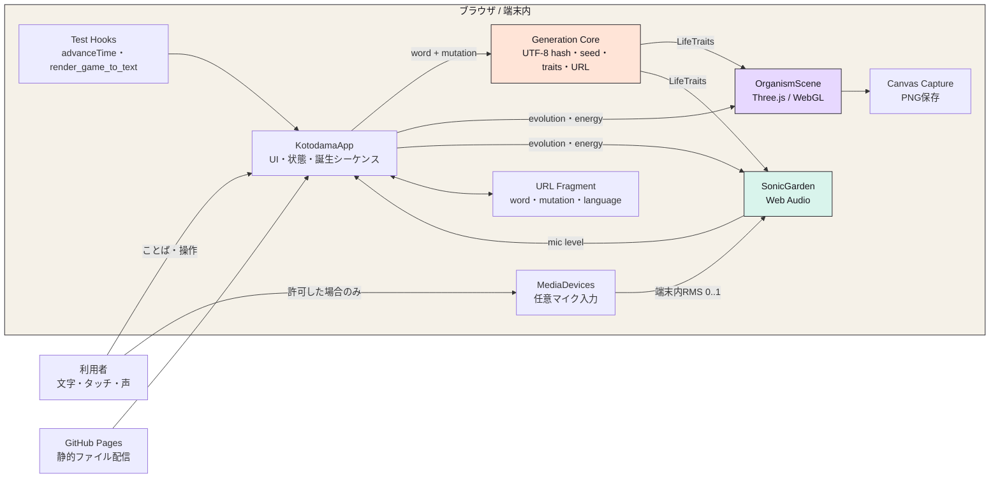
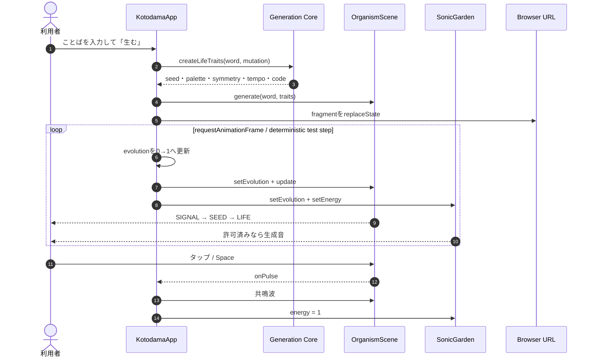
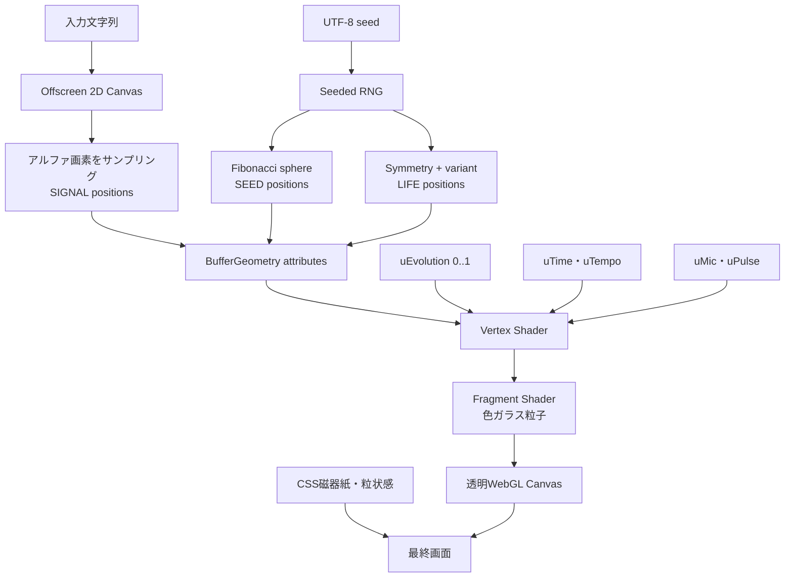
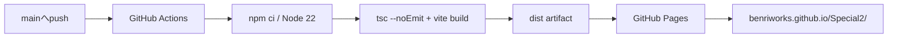

# KOTODAMA アーキテクチャ図

このファイルは、KOTODAMAの構造と主要な実行フローをMermaidで表した独立ドキュメントです。文章による詳細は [architecture.md](architecture.md) を参照してください。

## コンポーネント構成

```mermaid
flowchart LR
    U["利用者<br/>文字・タッチ・声"]
    P["GitHub Pages<br/>静的ファイル配信"]

    subgraph B["ブラウザ / 端末内"]
        UI["KotodamaApp<br/>UI・状態・誕生シーケンス"]
        GEN["Generation Core<br/>UTF-8 hash・seed・traits・URL"]
        VIS["OrganismScene<br/>Three.js / WebGL"]
        AUD["SonicGarden<br/>Web Audio"]
        MIC["MediaDevices<br/>任意マイク入力"]
        EXP["Canvas Capture<br/>PNG保存"]
        URL["URL Fragment<br/>word・mutation・language"]
        HOOK["Test Hooks<br/>advanceTime・render_game_to_text"]
    end

    P --> UI
    U -->|"ことば・操作"| UI
    UI -->|"word + mutation"| GEN
    GEN -->|"LifeTraits"| VIS
    GEN -->|"LifeTraits"| AUD
    UI -->|"evolution・energy"| VIS
    UI -->|"evolution・energy"| AUD
    U -->|"許可した場合のみ"| MIC
    MIC -->|"端末内RMS 0..1"| AUD
    AUD -->|"mic level"| UI
    VIS --> EXP
    UI <--> URL
    HOOK --> UI

    style B fill:#f5f1e8,stroke:#17151c,color:#17151c
    style VIS fill:#e7d8ff,stroke:#17151c,color:#17151c
    style AUD fill:#d9f4ec,stroke:#17151c,color:#17151c
    style GEN fill:#ffe4d7,stroke:#17151c,color:#17151c
```

## 誕生シーケンス

```mermaid
sequenceDiagram
    autonumber
    actor User as 利用者
    participant App as KotodamaApp
    participant Gen as Generation Core
    participant Scene as OrganismScene
    participant Audio as SonicGarden
    participant URL as Browser URL

    User->>App: ことばを入力して「生む」
    App->>Gen: createLifeTraits(word, mutation)
    Gen-->>App: seed・palette・symmetry・tempo・code
    App->>Scene: generate(word, traits)
    App->>URL: fragmentをreplaceState

    loop requestAnimationFrame / deterministic test step
        App->>App: evolutionを0→1へ更新
        App->>Scene: setEvolution + update
        App->>Audio: setEvolution + setEnergy
        Scene-->>User: SIGNAL → SEED → LIFE
        Audio-->>User: 許可済みなら生成音
    end

    User->>Scene: タップ / Space
    Scene-->>App: onPulse
    App->>Scene: 共鳴波
    App->>Audio: energy = 1
```

## 3Dモーフパイプライン

```mermaid
flowchart TB
    W["入力文字列"] --> C["Offscreen 2D Canvas"]
    C --> S["アルファ画素をサンプリング<br/>SIGNAL positions"]
    H["UTF-8 seed"] --> R["Seeded RNG"]
    R --> D["Fibonacci sphere<br/>SEED positions"]
    R --> L["Symmetry + variant<br/>LIFE positions"]

    S --> G["BufferGeometry attributes"]
    D --> G
    L --> G
    G --> V["Vertex Shader"]
    E["uEvolution 0..1"] --> V
    T["uTime・uTempo"] --> V
    M["uMic・uPulse"] --> V
    V --> F["Fragment Shader<br/>色ガラス粒子"]
    F --> O["透明WebGL Canvas"]
    CSS["CSS磁器紙・粒状感"] --> COMPOSE["最終画面"]
    O --> COMPOSE
```

## 配信フロー

```mermaid
flowchart LR
    DEV["mainへpush"] --> CI["GitHub Actions"]
    CI --> INSTALL["npm ci / Node 22"]
    INSTALL --> BUILD["tsc --noEmit + vite build"]
    BUILD --> DIST["dist artifact"]
    DIST --> PAGES["GitHub Pages"]
    PAGES --> LIVE["benriworks.github.io/Special2/"]
```
